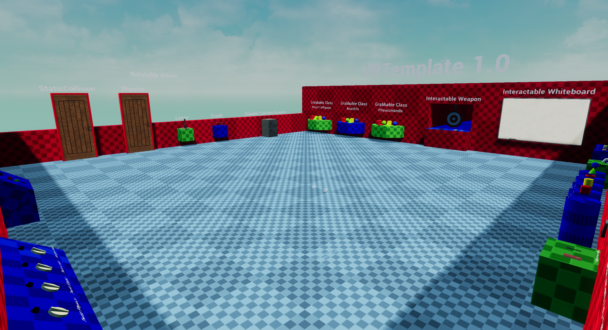

# VRTemplate 1.0

Overview:

A Virtual Reality template created using Unreal Engine and running currently for version UE4.23, the project includes a demo level showing examples of how 
each component/actor can be used as well as comments across all of my classes where I have tried to best describe why I have wrote the code in the way I have. 
Also in the h files I have commented over each funtion what they do. The base of everything works through the VRHand class and the hand interface which allows 
modular use of the classes I have created.

Features:

- Working VRPawn and VRHand classes for grabbing objects.
- A comprehensive movement class that supports six movement modes.
- Developer mode that allows testing using keyboard, mouse and monitor without a VR headset.
- Grabbable objects.
- Rotatable objects.
- Slidable objects.
- Working white board, marker and rubber.
- Weapon and target examples.
- Modular Dials, switches and buttons that can be added to other intractable.
- A demo level showing all of the features mentioned above.

Please visit the documentation I have extracted using doxywizard at the following link.

http://lewisscrivens.github.io/VRTemplateDoc

NOTE: The template was developed using a HTC Vive but this build was tested using a Valve index, also supports the oculus.

----------------------------------------------------------------------------------

Demo Room:

Build link: https://drive.google.com/file/d/1dMQHIPqtKw6h97qrubUI5sbPtXTrx9fg/view?usp=sharing

NOTE: Click the image bellow to find a video of me describing each part of the demo room.

